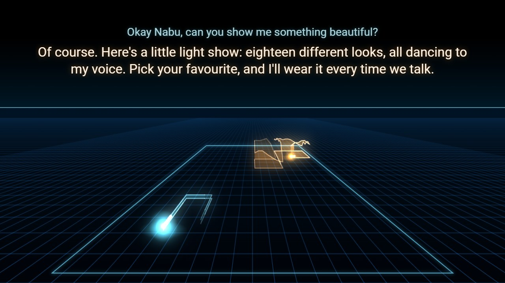
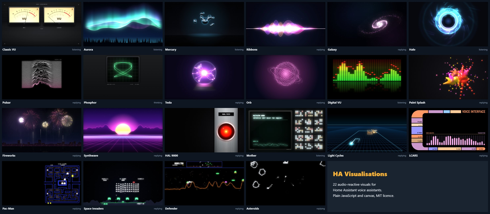
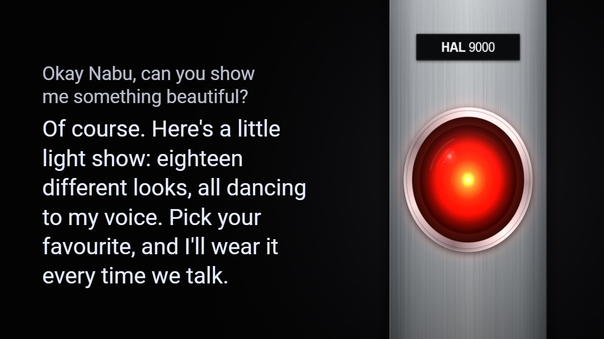
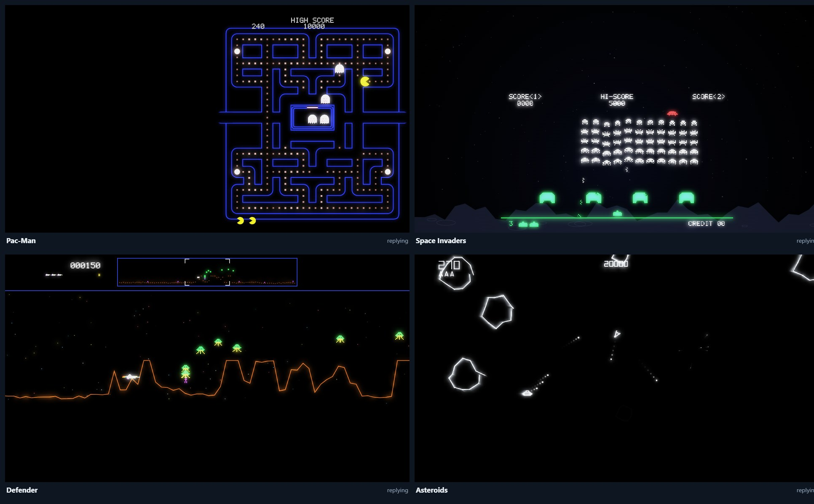

# HA Visualisations

Audio-reactive visuals for Home Assistant voice assistants. When you talk to Assist, your dashboard or wall panel shows a
full-screen visual that reacts to the real sound. While it listens, it follows your voice through the screen's microphone. While
it answers, it follows the assistant's actual reply audio, and the reply is shown as captions that turn page in time with the speech.

There are 22 visuals to choose from. They're plain JavaScript and canvas, with no dependencies and nothing to install beyond copying four files.

## What it does

- **Reacts to real audio.** It follows your voice while the assistant listens. While it replies, it fetches the reply's own speech audio from Home Assistant, analyses it (loudness, a 32-band spectrum and the waveform) and plays that back in sync with the speaker.
- **Shows the whole reply as captions.** Long answers are split into pages that fit the screen, and each page turns at the real pauses in the speech. The visual stays up until the speaker has actually finished, even if the satellite reports "idle" early.
- **Works without configuration.** It follows the first Assist satellite it finds, and the speaker (media player) on the same device.
- **Choose a look.** Use a gallery page with live previews, or a dropdown helper that picks the visual for every screen. "Surprise me" picks a different one each time.
- **Updates itself.** A small loader checks for a new build every few minutes and swaps it in between conversations, so screens pick up updates without a refresh.

## Install

1. Copy the four files in [`dist/`](dist) into `/config/www/voice-visuals/` on your Home Assistant.
2. Go to **Settings → Dashboards → ⋮ → Resources** and add `/local/voice-visuals/voice-visuals-loader.js` as a **JavaScript module**. You need Advanced mode turned on in your user profile to see Resources.
3. Reload the dashboard in your browser, then talk to your assistant.

Optional:

- **Choose the visual for every screen:** create a Dropdown helper called `voice_visual` (`input_select.voice_visual`). Give it the visual names below as options, plus `Surprise me`.
- **Browse and preview the visuals:** open `/local/voice-visuals/gallery.html`. Its "This screen" setting turns the visuals on or off for one screen only.
- **Change the defaults:** put a `config.json` next to the other files ([example](examples/config.json)).

## Configuration

Every setting is optional. Leave one out or empty to use the default.

| Key | Default | What it does |
|---|---|---|
| `satellite` | first `assist_satellite` found | The Assist satellite to follow. Set it if you have more than one. |
| `speaker` | the media player on the satellite's device | The speaker that plays replies. It's used to keep the visual up until the reply has finished. |
| `heardSensor` / `replySensor` | none | Sensors holding the last thing you said and the last reply. Without them, both come from Home Assistant's record of each conversation. |
| `roomLevelSensor` | none | A room sound-level sensor, used as a fallback source for the visual. |
| `skinSelect` | `input_select.voice_visual` | The dropdown helper that picks the visual. |
| `skin` | `Classic VU` | The visual to use when there's no helper. |
| `assistantName` | `Assist` | The name printed on the meters and scopes. |
| `dashboards` | every dashboard | Show the visuals only on dashboard paths starting with this, e.g. `/wall-panel`. |

## Good to know

- **You need an Assist satellite**, such as Home Assistant Voice Preview Edition, an ESPHome voice satellite or a browser-based satellite.
- **The reply audio and full transcript need an admin user.** They come from Home Assistant's Assist pipeline debug data, which only admin users can read. On other screens the visuals fall back to a smooth synthetic animation.
- **The microphone needs HTTPS.** Browsers only allow microphone access on HTTPS or localhost. Without it, the listening visuals use the same fallback animation.
- **It learns each satellite's timing.** Some satellites wait for the whole reply before speaking. The overlay measures how long a satellite takes to start from the end of each reply, and gets more precisely in sync over the first few conversations.
- Built and tested on Home Assistant 2026.8.

## The visuals

| Visual | |
|---|---|
| Classic VU | Twin backlit analogue VU meters with real needle ballistics: one for you, one for the assistant. |
| Aurora | Northern lights over the pines: green curtains for you, violet for the assistant, rippling on every syllable. |
| Mercury | Liquid chrome that throws off droplets on every syllable, then pulls them back in. |
| Ribbons | Silky ribbons of light that twist and cross, melting into white where they overlap. |
| Galaxy | A spiral galaxy that spins up as you talk; every syllable sends a shockwave through its arms. |
| Halo | A ring of mirrored spectrum bars tunnelling into light, flashing on each syllable. |
| Pulsar | The famous pulsar plot, alive: a fresh ridge of your voice rolls in every 55 milliseconds. |
| Phosphor | A green-phosphor oscilloscope: your voice as a live trace, the assistant's as Lissajous figures. |
| Tesla | A plasma globe whose lightning multiplies with your voice. |
| Orb | A living sphere of light points, sculpted by the spectrum. |
| Digital VU | An LED spectrum analyser with falling peak caps, mirrored in a black glass floor. |
| Paint Splash | Glossy paint thrown on every syllable: cool colours for you, hot for the assistant. |
| Fireworks | Every syllable launches a shell over a night-time harbour. |
| Synthwave | An 80s neon sunset: the sun pulses with the voice, the mountains are its spectrum. |
| HAL 9000 | The calm red eye from *2001: A Space Odyssey*, glowing as the assistant speaks. |
| Mother | MU/TH/UR 6000 from *Alien*: a green terminal beside a wall of chattering lamps. |
| Light Cycles | *Tron*'s Grid: two light cycles turn on every syllable and leave walls shaped like your voices. |
| LCARS | The *Star Trek* console, with spectrum bars that light as you talk. |
| Pac-Man | A neon maze. Your syllables make Pac-Man chomp and dash; when the assistant answers, the ghosts turn blue and flash with its voice. |
| Space Invaders | The cannon fires on your syllables; when the assistant answers, the invaders bob to its voice, march faster and drop bombs. |
| Defender | A scrolling planet whose mountains are your voices. Your syllables fire the laser; the assistant's voice sends landers after the humanoids. |
| Asteroids | A glowing vector rock field. Your syllables aim and fire; while the assistant answers, the rocks ripple with its voice and a saucer joins the fight. |

## Development

- `python build.py` joins `src/*.js` into `dist/`, and syntax-checks the result if Node.js is installed.
- `test/demo.html?skin=hal-9000&t=7.7&run=0` renders one visual at one moment of the built-in demo conversation.
- `test/overlay-test.html` fakes Home Assistant and plays a short or a long conversation through the full overlay.
- `test/sheet.html` draws all the visuals into one image.

Serve the repository folder over HTTP (for example `python -m http.server`) and open those pages.

## Tributes and credits

Eight of the visuals are fan tributes to the games and films that inspired them. Everything is drawn in code: the sprites, the maze, the rock outlines and the pixel and vector lettering are new drawings in the style of the originals. No artwork, fonts, sounds or code were taken from any of them.

**Arcade games**

| Visual | A tribute to |
|---|---|
| Space Invaders | *Space Invaders*, Taito, 1978, designed by Tomohiro Nishikado. |
| Asteroids | *Asteroids*, Atari, 1979, designed by Lyle Rains and Ed Logg. |
| Pac-Man | *Pac-Man*, Namco, 1980, designed by Toru Iwatani. The maze here is a new layout. |
| Defender | *Defender*, Williams Electronics, 1981, designed by Eugene Jarvis with Larry DeMar, Sam Dicker and Paul Dussault. |

**Films and television**

| Visual | A tribute to |
|---|---|
| HAL 9000 | HAL in *2001: A Space Odyssey* (1968), by Stanley Kubrick and Arthur C. Clarke. |
| Mother | MU/TH/UR 6000, the ship's computer in Ridley Scott's *Alien* (1979). |
| Light Cycles | *Tron* (1982), written and directed by Steven Lisberger, with light cycles designed by Syd Mead. |
| LCARS | The computer displays Michael Okuda designed for *Star Trek: The Next Generation* (1987). |

**Other inspirations**

- **Pulsar** redraws the stacked plot of radio pulses from PSR B1919+21, the first pulsar, discovered by Jocelyn Bell Burnell and Antony Hewish in 1967. Harold Craft plotted it for his 1970 thesis, and Peter Saville used it for the cover of Joy Division's *Unknown Pleasures* (1979).
- **Tesla** is named for Nikola Tesla, whose experiments with high-frequency discharges in glass tubes led to the plasma globe.
- **Paint Splash** was inspired by the paint animation in ASUS's OLED Care screensaver. The paint here is simulated from scratch.
- The idea of a full-screen visual that follows the voice came from the Lens Flares effect in jxlarrea's [Voice Satellite](https://github.com/jxlarrea/voice-satellite-card-integration) integration for Home Assistant. That effect isn't included here.
- The demo conversation is stored as loudness and spectrum measurements of speech made with [Piper](https://github.com/OHF-Voice/piper1-gpl) (the en_GB-alba voice). No audio is included.

The names above are trademarks or titles of their respective owners. This project isn't affiliated with or endorsed by any of them.

## Licence

MIT. See [LICENSE](LICENSE).
